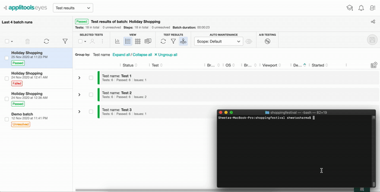
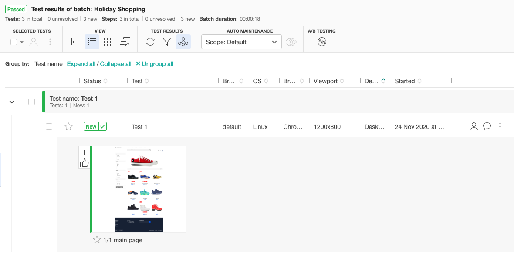
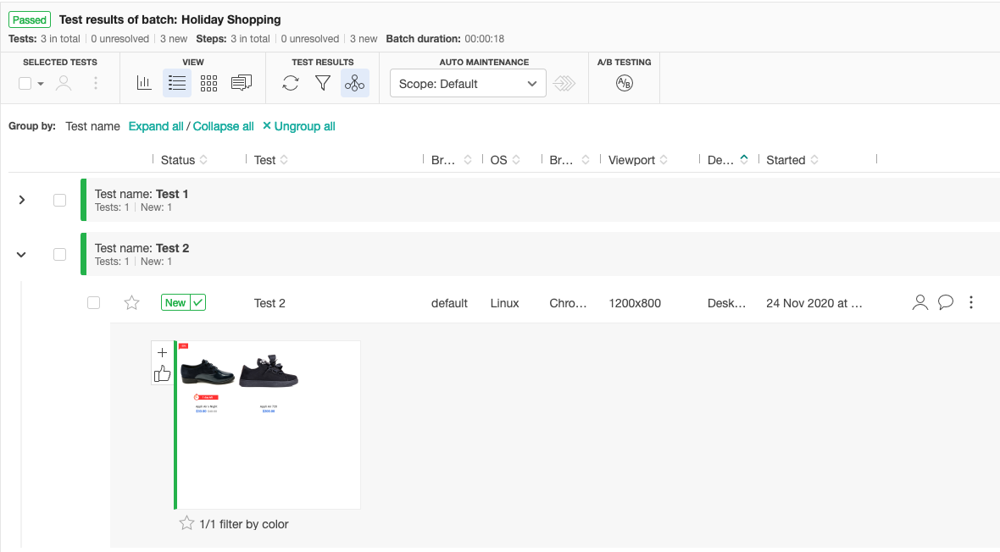
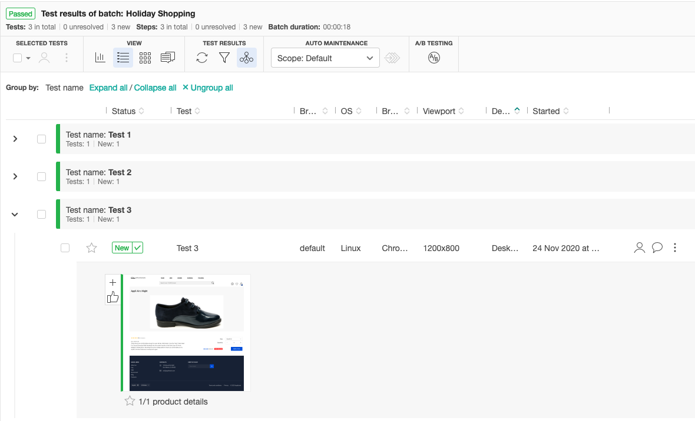
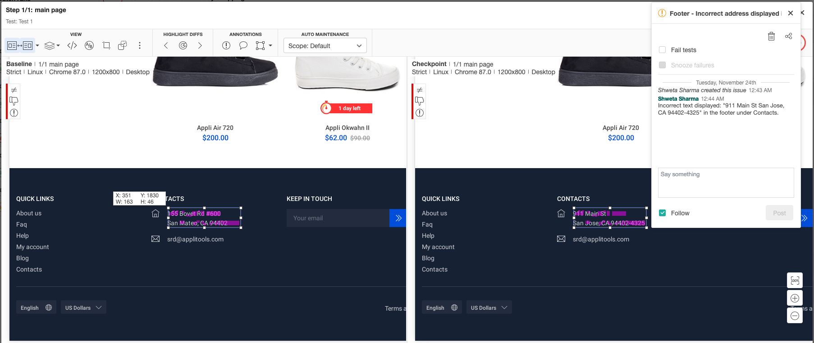
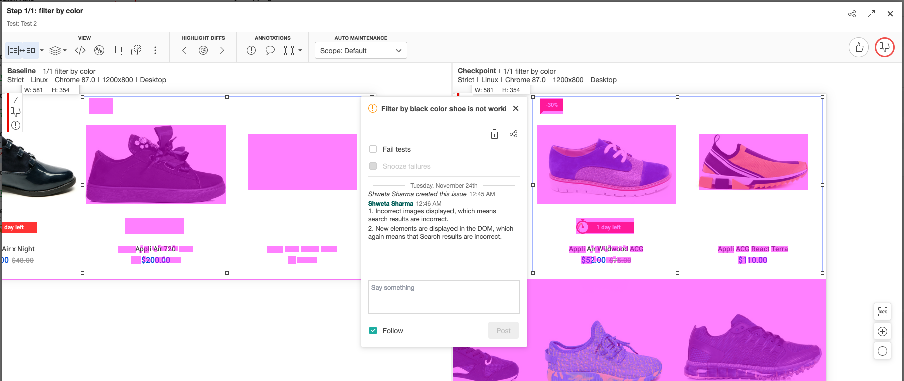
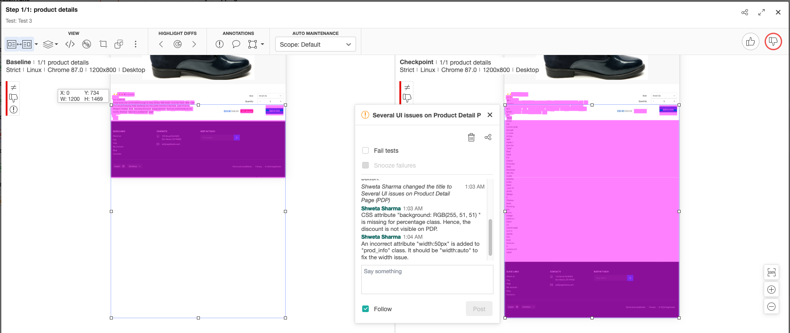
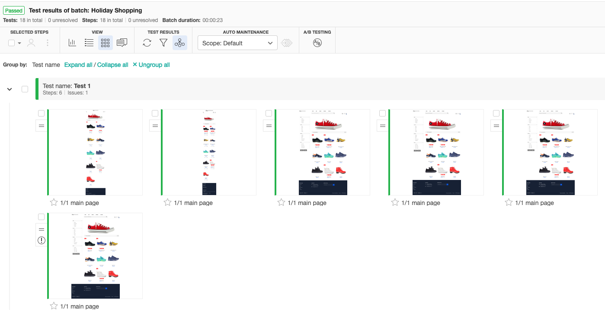
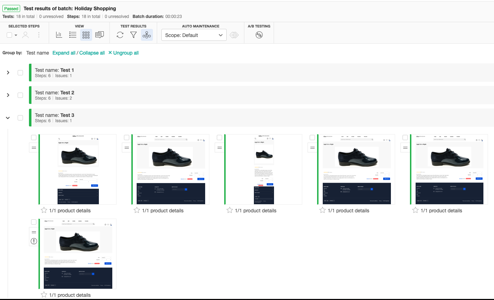
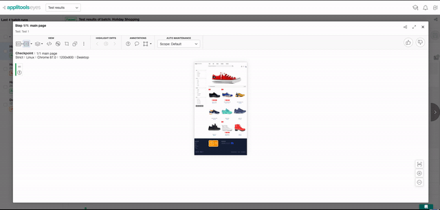

# Applitools Holiday Shopping Festival Hackathon

#### Automated visual validation testing using Applitools across several browsers and devices using Ultrafast Cloud solution from Applitools.

## Table of Contents
1. [About the repository](#about)  
2. [Demonstration](#demo)
3. [Installation](#installation)
4. [Execution using the terminal](#terminalExecution)
5. [Execution using Eclipse IDE](#IDEExecution)
6. [Test Execution Results](#executionResults)
7. [Pixel based comparison demo](#pixelDemo)

## About the repository
* This repository was created as part of [Applitools Holiday Shopping Hackathon entry](https://applitools.com/hackathon-v20-3-instructions/).
* This assignment is created using [Selenium webdriver]() available in Java binding to automate the browser actions.  
* [TestNG]() is used as the testing framework.  
* It also uses Maven to manage dependencies effortlessly.  
* **Structure:**
  - Two packages:
    - applitools.HolidayShoppingHackathon
    - base
  - Two classes:
    - BaseTests.java
    - AllTests.java
  - resources directory
    - chromedriver
  - pom.xml
  - testng.xml
    

## Demonstration

## Prerequisites & Installation
* An account is created with Applitools. If you don't have one, you can create a free account from [here](https://auth.applitools.com/users/register).  
* **_Dependencies:_**  
  - Java 11  
  - Maven 3.6.3  
  - Chrome browser. I currently have v87 on my machine.
  - Chromedriver executable
* The environment variable for `APPLITOOLS_API_KEY` is correctly set in your system path.  
* The chromedriver should be compatible with your browser version. Click here to understand what version is applicable to your machine and replace it with the one placed in the _resources_ directory.

## Execution (using the terminal)
1. Clone the repository using the command `git clone https://github.com/shwetaneelsharma/applitools-holiday-shopping-festival-hackathon.git`.  
2. Open the terminal and navigate to the project directory.  
3. To run all the tests, execute the command `mvn clean test -DsuiteXmlFile=testng.xml` in your terminal.  
4. **NOTE:** Since chrome is configured to run in headless mode, you will not see a physical browser opening up.

## Execution (using the IDE)
1. Import the maven repository in the Eclipse IDE.  
2. Right click on `testng.xml` -> `Run As -> `TestNG Suite`. 

## Test Execution Results  
### PART 1
|Main Page|Filtered Product Grid|Product details|
|---------|---------------------|---------------|
||||

### PART 2
|Main Page|Filtered Product Grid|Product details|
|---------|---------------------|---------------|
||||

### PART 3
|Main Page|Filtered Product Grid|Product details|
|---------|---------------------|---------------|
||||

## Pixel based comparison demo using the _Exact_ match level

